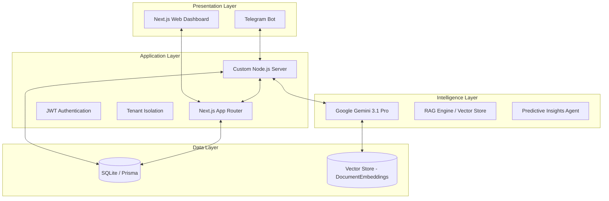

# MSME AUTOPILOT: AGENTIC INVENTORY INTELLIGENCE PLATFORM
## Architecture & Implementation Overview

### 1. System Architecture
The platform is built as a unified Next.js application with a custom Node.js server to handle background agentic tasks and real-time Telegram bot interactions.



### 2. Core Components
- **Next.js App Router**: Handles the web dashboard, user management, and data visualization.
- **Custom Server (`server.ts`)**: 
    - Manages the HTTP lifecycle.
    - Schedules background cron jobs for predictive stockout analysis.
    - Orchestrates the Telegram Bot.
- **Telegram Bot (`lib/telegram`)**: 
    - Provides a mobile-first interface for MSME owners.
    - Supports registration, login, stock viewing, and AI-powered business queries.
    - Implements RAG (Retrieval-Augmented Generation) for context-aware chat.
- **Intelligence Engine**:
    - **Predictive Insights**: Hourly analysis of sales velocity and lead times to generate automated Purchase Orders.
    - **RAG System**: Vectorizes business data (inventory, sales) using Gemini Embeddings for deep contextual understanding.
- **Prisma ORM**: Ensures type-safe database interactions with SQLite.

### 3. Folder Structure
```text
/
├── app/                    # Next.js App Router (Frontend & API)
│   ├── (auth)/             # Web Authentication
│   ├── (dashboard)/        # Business Dashboard
│   ├── api/                # RESTful API Endpoints
│   └── layout.tsx          # Root Layout with Motion Animations
├── lib/                    # Shared Logic & Core Services
│   ├── ai/                 # Vector Store & Embedding Logic
│   ├── db/                 # Prisma Client & Repositories
│   ├── telegram/           # Telegram Bot & Conversation Scenes
│   └── core/               # Auth & Utility Functions
├── prisma/                 # Database Schema & Migrations
├── server.ts               # Main Server Entry Point & Background Jobs
└── ARCHITECTURE.md         # This documentation
```

### 4. Enterprise & Research Grade Features
- **Tenant Isolation**: All data queries are scoped to the `tenantId`.
- **Predictive Analytics**: Uses daily velocity and lead-time buffers to anticipate stockouts.
- **Automated Governance**: AI-generated Purchase Orders require human approval via Telegram before execution.
- **Audit Logging**: Tracks critical user actions for compliance and transparency.
- **RAG-Powered Chat**: Combines real-time business data with LLM reasoning for accurate insights.
- **Graceful Shutdown**: Handles process signals to ensure database integrity.

### 5. Deployment
- **Containerization**: Optimized for Google Cloud Run or similar container platforms.
- **Environment**: Managed via `.env` with strict validation for API keys and bot tokens.
